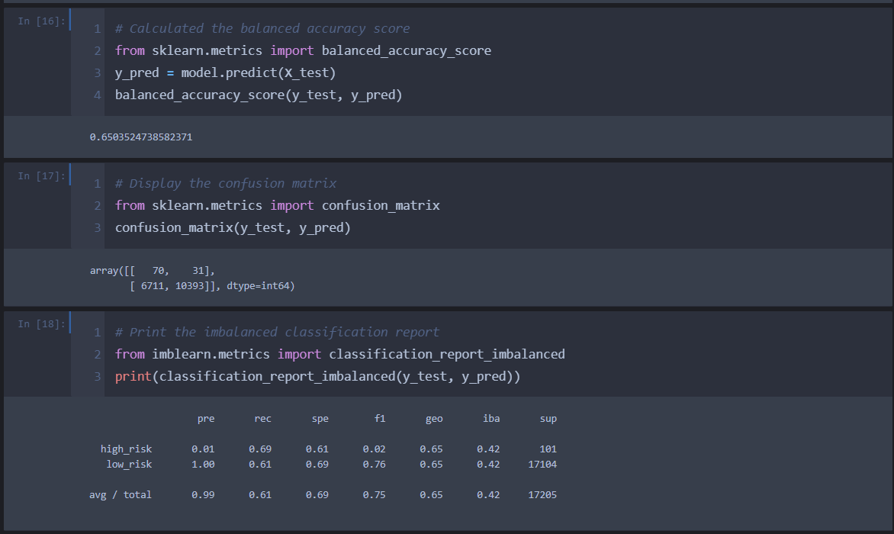
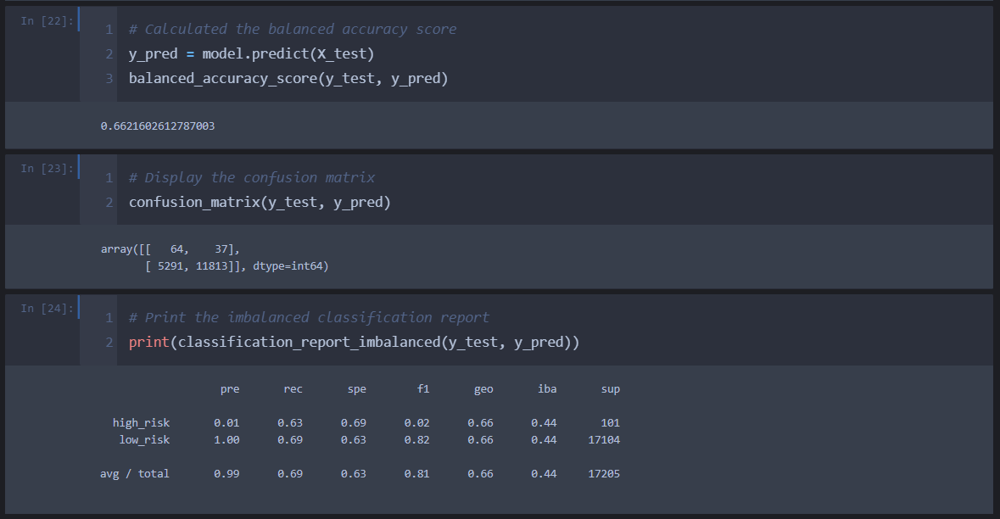
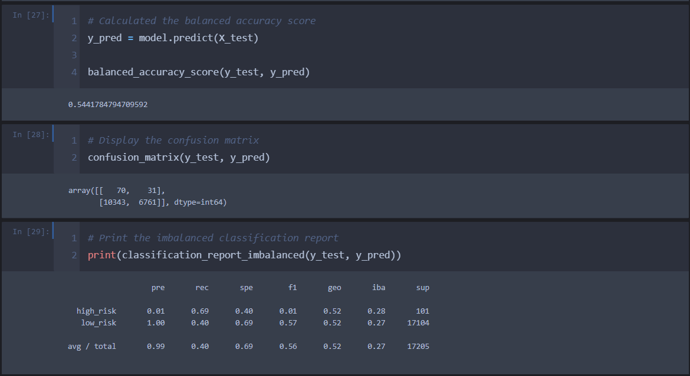
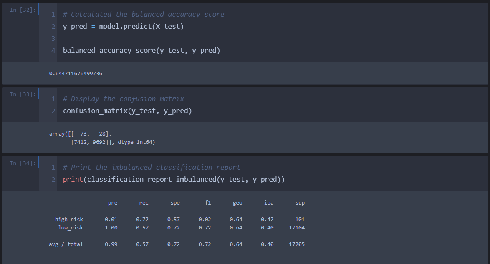
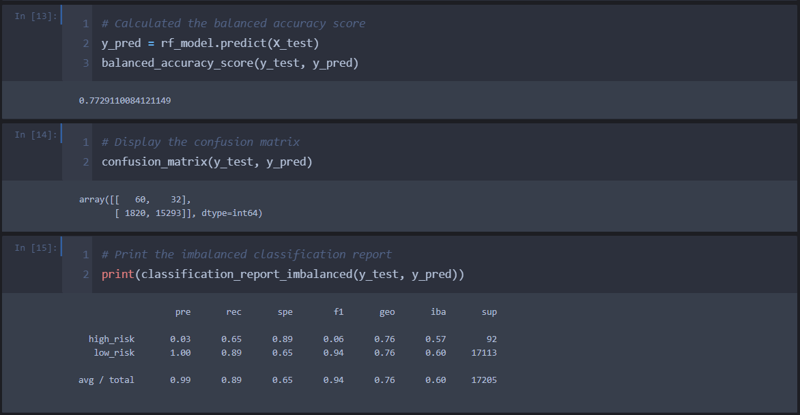
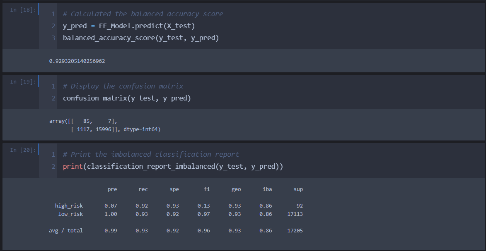

# Credit_Risk_Analysis

## Overview 

Analysing credit risk is one of the most important for a financing company. In this project we are trying to predict credit risk for credit cards, utilising available data from LendingClub, a peer-to-peer lending services company. This will be accomplished by implementing different modelling techniques using supervised machine learning, such as logistic regression, random forest sampling, oversampling technique, different ensemble techniques, boosting and SMOTEENN algorithm.

## Purpose

The purpose of this analysis is to perform credit risk analysis for the available credit card from LendingClub, a peer-to-peer lending services company and evaluate performance of different models used to predict credit risk

## Results
 

####Naive Random Oversampling

Results of this model shows accuracy of 65%, with very low precision of high risk is 0.01 and precision for low risk is 1. It means there are high number of false positive in the model that we have predicted to be at high risk. While recall score for high risk is 0.61 and low risk is 0.69, which indicate that we are still predicting few high risks as low risk. Also, this becomes clearer when we check F1 values, as it is 0.02 for high risk while for low-risk prediction it is 0.76.

#### SMOTE Oversampling

 

Results follows previous model and shows accuracy of 66%, with very low precision of high risk is 0.01 and precision for low risk is 1. It means there are high number of false positive in the model that we have predicted to be at high risk. While recall score for high risk is 0.63 and low risk is 0.69, which indicate that we are still predicting few high risks as low risk. Also, this becomes clearer when we check F1 values, as it is 0.02 for high risk while for low-risk prediction it is 0.82. The improvement is considerable, however not substantial.

#### Undersampling Model

 

With this model accuracy is dropped to 54%, with very low precision of high risk is 0.01 and precision for low risk is 1. It means there are high number of false positive in the model that we have predicted to be at high risk. While recall score for high risk is 0.69 and low risk is 0.40, which indicate that we are predicting few more high risks as low risk as compared to previous models. Also, this becomes clearer when we check F1 values, as it is 0.01 for high risk while for low-risk prediction it is 0.57. It is clear that undersampling technique has not helped us much and we have to think for another techniques.

#### Combination of Over and Under Sampling

 

Accuracy for this model is coming out to be 64%, with very low precision of high risk is 0.01 and precision for low risk is 1. It means there are high number of false positive in the model that we have predicted to be at high risk. While recall score for high risk is 0.72 and low risk is 0.57, which indicate that we are still predicting few high risks as low risk in our models. Also, this becomes clearer when we check F1 values, as it is 0.02 for high risk while for low-risk prediction it is 0.72. 

#### Balanced Random Forest Classifier

 

The model seems to be improving now and accuracy is 77%, with very low precision of high risk is 0.03 and precision for low risk is 1. It means there are high number of false positive in the model that we have predicted to be at high risk. While recall score for high risk is 0.65 and low risk is 0.89, which indicate that we are still predicting few high risks as low risk in our models. Also, this becomes clearer when we check F1 values, as it is 0.06 for high risk while for low-risk prediction it is 0.94.

#### Easy Ensemble AdaBoost Classifier 

 

Good improvement from prediction side of the model and accuracy is coming out to be 92%, with very low precision of high risk is 0.07 and precision for low risk is 1. It means there are high number of false positive in the model that we have predicted to be at high risk. While recall score for high risk is 0.92 and low risk is 0.93, which is a considerable change in predicting high risks and low risk, when compared to previous models. However, when we check F1 values, it is 0.13 for high risk (a little improved from previous models) while for low-risk prediction it is 0.97.

## Summary

We performed credit risk analysis on the credit card data and tried to find out high risk and low risk exposures. If we consider importance for the financial institution, identifying high risk exposures are more important for the business. Hence, we shall try to analyse these models from the perspective of predicting high risks. 

The first 2 models and 4th model viz. “Naive Random Oversampling”, “SMOTE Oversampling” and “Combination of Over and Under Sampling” had accuracy around 65%. However, all failed to predict high risk exposures efficiently and predicted high risks as low risk for some or few occasions as per the recall (sensitivity) metric. While, Undersampling Model had very low accuracy and had low recall score as well. 

Balanced Random Forest Classifier also had good accuracy of 77%, but recall score was similar to previous models and predicting high risks as low risks for some observations.

Whereas, Easy Ensemble AdaBoost Classifier had the best results out of all the models we tried to run. It had accuracy of 92% with high recall score of .92 and able to identify maximum high risk observations. 

Since we are trying to understanding credit risk, it is more important to identify high risks and few false identifications (false positives for high risks) of high risks can be neglected. Hence, I recommend Easy Ensemble AdaBoost Classifier model out of the 6 models we tried to predict risks from the given data. Potentially, there are less prediction where we predicted high risk observations as low risk and we can ignore F1/precision score, as for this case recall(sensitivity) is more important than the precision. 
